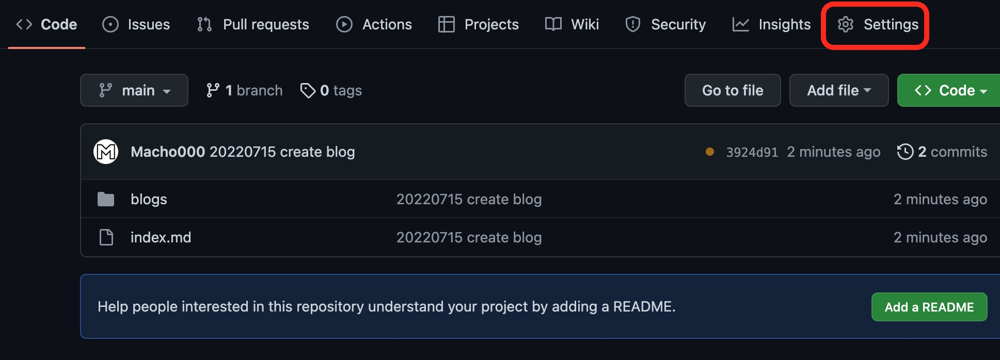
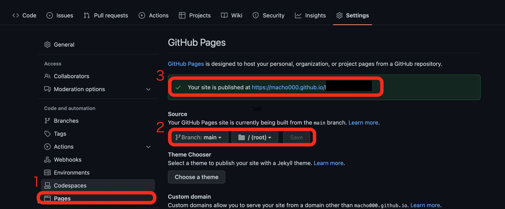

# Githubを利用したMarkdownでの記事執筆

## 環境一覧
- VSCode
- Github

## VSCode
VSCodeに必要な拡張機能をインストール
- [Markdown Preview]([shd101wyy.markdown-preview-enhanced](https://marketplace.visualstudio.com/items?itemName=shd101wyy.markdown-preview-enhanced))
- [Markdown Image](https://marketplace.visualstudio.com/items?itemName=hancel.markdown-image)

## Github
下記のディレクトリ構成のフォルダを作成
```
blogs/
images/
index.md
```

index.mdには以下のファイルの内容
```
- [Blogs](blogs/home.md)

# 自己紹介

```

下記のようにアップロードできたら、Settingsをクリック

  


1,2,3の順番で以下のとおりに設定
３番目のURLをクリックするとindex.mdの内容が表示される。
  
