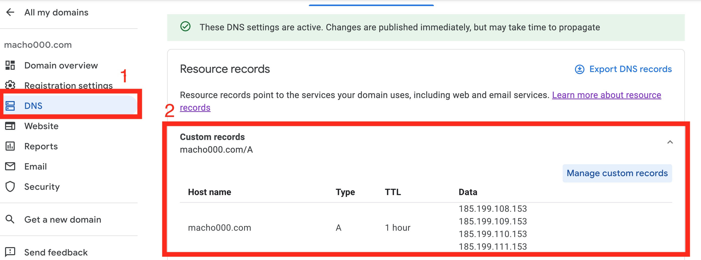
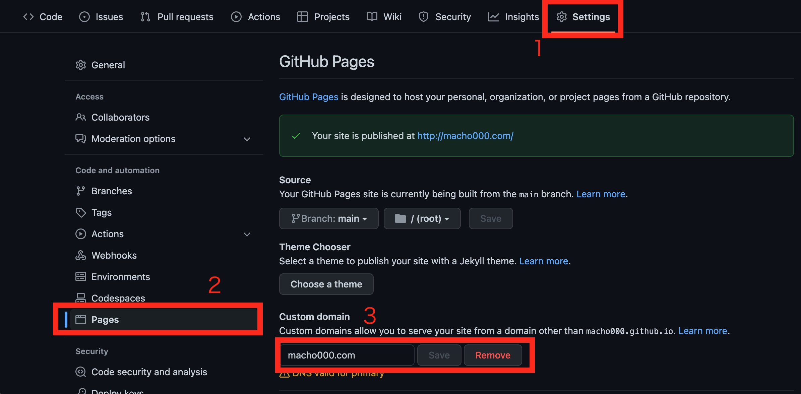
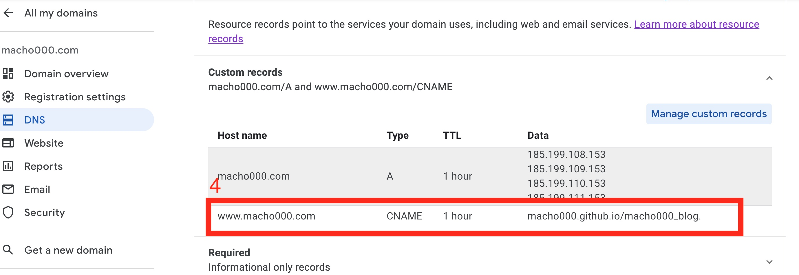

# Github Pagesとカスタムドメイン（Google Domain）の紐付け

## 用語解説
__Apexドメイン__
Apexドメインとは、サブドメインではないドメインのこと。たとえば、Google Domainでmacho000.comというドメインを購入した場合macho000.comがApexドメインになる。

## Apexドメインの設定
- __Google DomainのDNSの設定__
  

Data(Ipv4アドレス)には[Github Doc]([Github Doc](https://docs.github.com/ja/pages/configuring-a-custom-domain-for-your-github-pages-site/managing-a-custom-domain-for-your-github-pages-site))にかかれているIPアドレスを指定。
今回の場合は、以下の画像より
```
185.199.108.153
185.199.109.153
185.199.110.153
185.199.111.153
```
を指定する。
   
  
- DNSレコードが更新されたことを確認する
以下のコマンドを打ち、DNSのレコードの更新を確認する。
```
dig <your domain> +noall +answer
```

- GithubのSettingで、Custom Domainを登録する
  
まず、Setting画面を開き、次にPagesをクリック、最後にCustom Domainに先程登録したApexドメインを登録する

## サブドメインの設定
- Google DomainのCustom RecordにCNAME Typeを追加
  

  

  


## 参考情報
[GitHub Pages に Google Domains で購入した独自ドメインを設定する](https://dev-moyashi.hatenablog.com/entry/2021/01/10/222249)